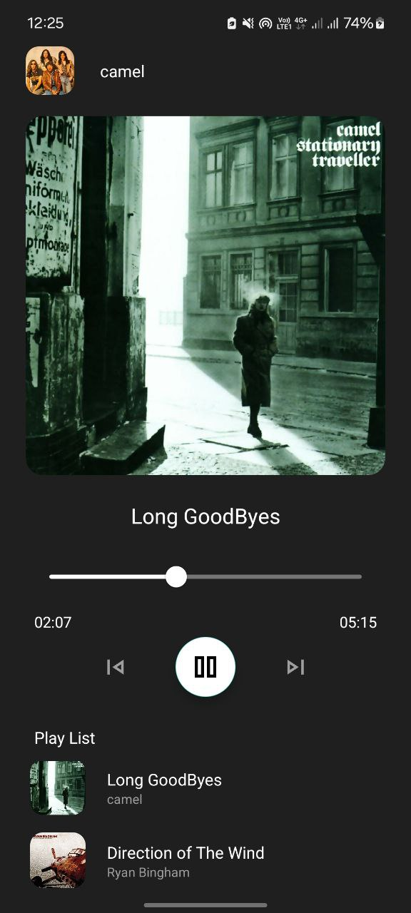

# 🎵 Music Player

A simple Android music player app. You can play, pause, next, and previous songs. The app shows a list of songs with the cover image and band name.  

---

## Features
- Play and pause music  
- Go to next or previous song  
- Show current song with a small animation  
- Slider to see and change the position of the song  
- Show time of song (current and total)  

---

## How it works
- The app uses `MediaPlayer` to play songs.  
- `RecyclerView` shows all songs.  
- Timer updates the slider and current time.  
- When a song ends, the next song starts automatically.  

---

## How to run
1. Clone the repository:  
   ```bash
   git clone https://github.com/Maatthyou/Maybe-Simple-Music-Player
---
  ## Screenshots

### First Screen


### Second Screen


 
